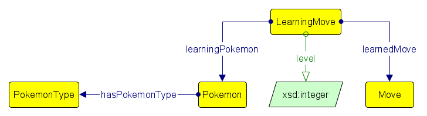

# Model Pokémon?!

```json

{"Bulbasaur-P": {"text": "type:Grass, Poison; 4:tackle-normal; 10:Razorleaf-grass; 12:acid-poison; 16:evolution to Ivysaur"}}

```

Look at this example. From this text we can say with direct relationships that
Bulbasaur is type grass and type poison.

But how can we say that at level 4 bulbasaur learns tackle?

We can use a N-ary relationship type of modeling by creating the class _LearningMove_ which is linked to the Pokémon with the property _learningPokemon_, to the move with the property _learnedMove_ and to the level with the data property _level_ . Use this example wisely when you try to model the data in the assignment.



