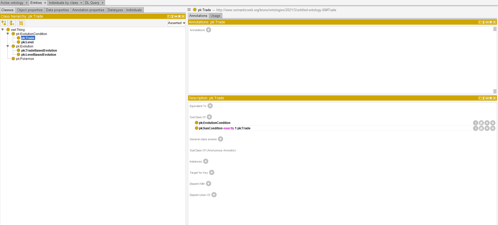
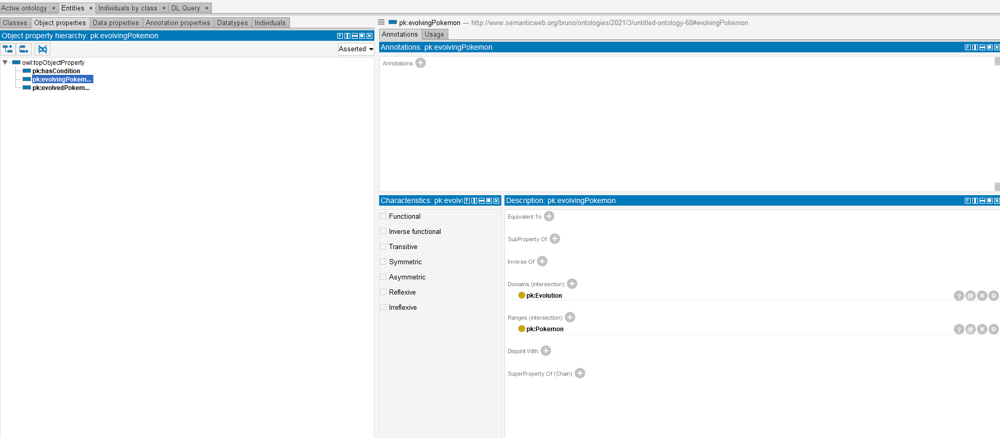

# Top down approach in Ontology Development

Ontologies are used to conceptualize a certain domain of our world.

A very important aspect of Ontology design and development is that **it's not a 1-person job.**

Often, an ontology is developed following requirements. These could come from  the main purpose of the ontology, indended as the tasks that you want to perform when you use your ontology to encode data (ex: an ontology specialized in inferences to classify data, or an ontology specific for the description, curation and preservation of the data). 

Other requirements could come from **domain experts**: domain experts are people who are very knowledgeable about a specific domain, that can help you develop the ontology by giving you direction on the concepts and relationship and also they are very useful when it comes to ontology evaluation and validation (for the content side).  

An ontology can be developed with the help of domain experts and their suggestions, but also by following **authoritative theories about the domain of interest.** 

Starting from the theory and general rules of your domain, either taken from authoritative texts or instructions given by domain experts, means using what is called a **top down approach**.

***

## Example

Let's Imagine that Nintendo asks us to develop an ontology based on Pokémon Evolution that needs to follow the Pokémon rules of evolution and you are given these instructions: 

"Pokémon can evolve in different ways. A level based evolution takes place when a Pokémon reaches a certain level. A trade based evolution instead, happens when a certain Pokémon gets traded.  

With this ontology we want to know what are the conditions of a certain Pokémon evolution, and what are the Pokémon are not part of any evolution.  

An example is that Charmender evolves into Charmeleon which Evolves into Charizard by leveling up (16 and 36). Abra evolves into Kadabra by leveling up (20) and Into Alakazam by being traded. Stantler does not evolve."  

### Steps to Model

#### Conceptualize the theory by creating classes and properties from the given definitions 

Taking a look at the theory, we can say that the emerging classes are:

* Pokémon  
* Evolution, with its subclasses LevelBasedEvolution and TradeBasedEvolution  
* EvolutionCondition, with its sublcasses Level and Trade  

An evolution has one **evolvingPokemon** and an **evolvedPokemon** and **hasCondition** one of the two conditions. 

#### Conceptualize the restrictions from the given definitions

A LevelBasedEvolution is a sublcass of Evolution that **hasCondition** **Level**  
A TradeBasedEvolution is a subclass of Evolution that **hasCondition** **Trade**.

#### Write your TBOX in Protégé

Pay attention to the restrictions.

you can find the TBOX [here](https://github.com/br0ast/KRaE-lab/blob/main/lesson3/tbox.owl)

#### Formalize the Competency questions from the examples

"With this ontology we want to know what are the conditions of a certain Pokémon evolution, and what are the Pokémon are not part of any evolution."

CQ1) Retrieve the conditions of a certain Pokémon evolution.  
CQ2) Retrieve the Pokémon that are not part of any evolution.  

#### Write a ABOX with the example provided

You can find the ABOX [here](https://github.com/br0ast/KRaE-lab/blob/main/lesson3/abox.ttl). It was developed using a very simple algorithm you can find [here](https://colab.research.google.com/github/br0ast/KRaE-lab/blob/main/lesson3/Verysimpleturtleandquery.ipynb).

#### Formalized the queries in SPARQL language and query your ABOX to check if the answers are correct according to what you expect

CQ1 expectation = level16  
CQ2 expectation = Stantler

You can find the queries and the results in the same file [here](https://colab.research.google.com/github/br0ast/KRaE-lab/blob/main/lesson3/Verysimpleturtleandquery.ipynb)

